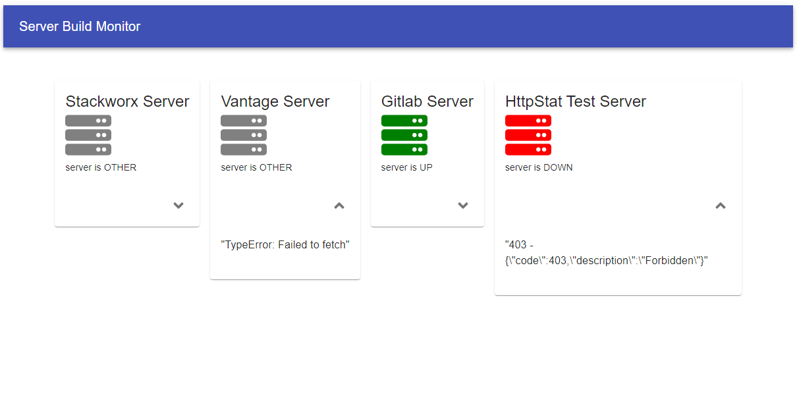

<p align="center">
  
</p>
# Server Build Monitor App
Displays whether a site is up, down or other based on the status code received
## Details

* This web app uses ReactJS and TypeScript.
* The server icon is displayed as green for UP and red for DOWN, GREY for other (E.g. request completely failed for example due to not having internet).
* Clicking on the down arrow must display the last response payload from the health endpoint.
* Endpoints are checked every 5 minutes.
* Uses the request and [request-promise](https://github.com/request/request-promise) library (For Async data fetching).

## Usage

* Installation and running dev build

Make sure that yarn is installed first.

```bash
npm install -g yarn
```
Then:

```bash
yarn install
yarn start
```

* Open http://127.0.0.1:3000/ in your browser


